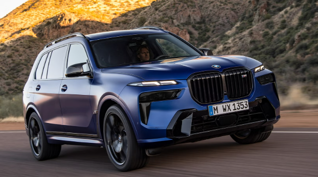
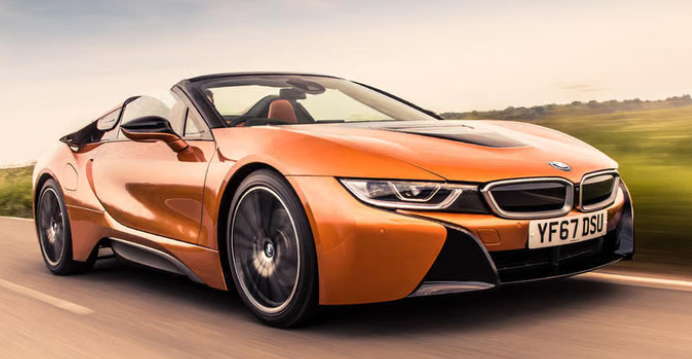
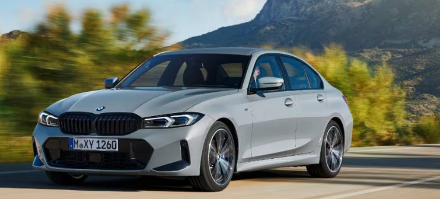
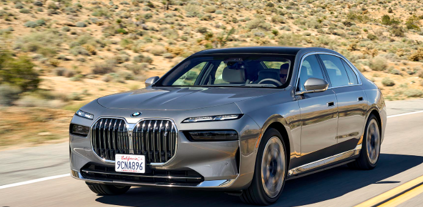
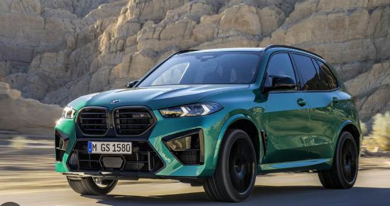
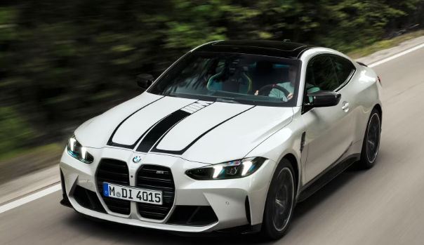

# Project Responsive Web Design using Bootstrap
## Date:20.11.2025

## AIM:
To create a simplified clone of Dribbble (https://dribbble.com/) landing page.


## DESIGN STEPS:

### Step 1:
Clone the repository from GitHub.

### Step 2:
Create Django Admin project.

### Step 3:
Create a New App under the Django Admin project.

### Step 4:
Insert the necessary CSS and JavaScript files as external in order to use Bootstrap.

### Step 5:
Create a HTML file and include the needed Bootstrap components.

### Step 6:
Publish the website in the LocalHost.

## PROGRAM :
```
<!DOCTYPE html>
<html lang="en">
<head>
    <meta charset="UTF-8">
    <meta name="viewport" content="width=device-width, initial-scale=1.0">
    <title>BMW Motors – Premium Cars</title>

    <link rel="stylesheet" href="https://stackpath.bootstrapcdn.com/bootstrap/4.5.2/css/bootstrap.min.css">
    <link rel="stylesheet" href="styles.css">

    <!-- Google Font -->
    <link href="https://fonts.googleapis.com/css2?family=Montserrat:wght@400;700&display=swap" rel="stylesheet">

    <style>
        body {
            font-family: 'Montserrat', sans-serif;
            background-image: url("v2.png"); /* Add your BMW background image */
            background-size: cover;
            background-position: center;
            background-attachment: fixed;
            color: white;
        }

        /* Navbar */
        .navbar {
            background: rgba(0, 0, 0, 0.7);
        }
        .navbar-brand {
            font-size: 1.5rem;
            font-weight: bold;
            color: #1e90ff !important; /* BMW Blue */
        }
        .nav-link {
            color: white !important;
        }

        /* Hero Section */
        .hero {
            text-align: center;
            padding: 120px 20px;
            background: rgba(0,0,0,0.6);
            border-radius: 15px;
            margin-top: 20px;
        }
        .hero h1 {
            font-size: 3rem;
            font-weight: bold;
            color: #1e90ff;
        }
        .hero p {
            font-size: 1.3rem;
        }

        /* Gallery Cards */
        .card {
            border-radius: 12px;
            overflow: hidden;
            transition: 0.3s ease-in-out;
        }
        .card:hover {
            transform: scale(1.05);
            box-shadow: 0px 10px 25px rgba(0,0,0,0.4);
        }
        .gallery-img {
            height: 200px;
            object-fit: cover;
        }

        /* Footer */
        footer {
            background: #000;
            color: #ddd;
            text-align: center;
            padding: 20px;
            margin-top: 40px;
        }
    </style>
</head>

<body>

    <!-- NAVBAR -->
    <nav class="navbar navbar-expand-lg navbar-dark">
        <a class="navbar-brand" href="#">BMW Motors</a>
        <button class="navbar-toggler" type="button" data-toggle="collapse" data-target="#navbarNav">
            <span class="navbar-toggler-icon"></span>
        </button>

        <div class="collapse navbar-collapse" id="navbarNav">
            <ul class="navbar-nav ml-auto">
                <li class="nav-item"><a class="nav-link" href="#">Models</a></li>
                <li class="nav-item"><a class="nav-link" href="#">Showroom</a></li>
                <li class="nav-item"><a class="nav-link" href="#">Offers</a></li>
                <li class="nav-item"><a class="nav-link" href="#">Contact</a></li>
                <li class="nav-item"><a class="btn btn-primary ml-3" href="#">Book a Test Drive</a></li>
            </ul>
        </div>
    </nav>

    <!-- HERO SECTION -->
    <div class="container mt-4">
        <div class="hero">
            <h1>BMW Premium Cars</h1>
            <p>“Sheer Driving Pleasure – Explore our latest luxury performance models.”</p>
        </div>

        <!-- CAR GALLERY -->
        <div class="row mt-4">

            <!-- Item 1 -->
            <div class="col-md-3 col-sm-6 mb-4">
                <div class="card">
                    
                    <div class="card-body text-dark text-center">
                        <h5 class="card-title">BMW M5 Competition</h5>
                        <p class="text-muted">₹1.80 Crore</p>
                    </div>
                </div>
            </div>

            <!-- Item 2 -->
            <div class="col-md-3 col-sm-6 mb-4">
                <div class="card">
                    
                    <div class="card-body text-dark text-center">
                        <h5 class="card-title">BMW X7</h5>
                        <p class="text-muted">₹1.20 Crore</p>
                    </div>
                </div>
            </div>

            <!-- Item 3 -->
            <div class="col-md-3 col-sm-6 mb-4">
                <div class="card">
                    
                    <div class="card-body text-dark text-center">
                        <h5 class="card-title">BMW i8 Hybrid</h5>
                        <p class="text-muted">₹2.50 Crore</p>
                    </div>
                </div>
            </div>

            <!-- Item 4 -->
            <div class="col-md-3 col-sm-6 mb-4">
                <div class="card">
                    
                    <div class="card-body text-dark text-center">
                        <h5 class="card-title">BMW 3 Series</h5>
                        <p class="text-muted">₹55 Lakh</p>
                    </div>
                </div>
            </div>

            <!-- Item 5 -->
            <div class="col-md-3 col-sm-6 mb-4">
                <div class="card">
                    
                    <div class="card-body text-dark text-center">
                        <h5 class="card-title">BMW 7 Series</h5>
                        <p class="text-muted">₹1.70 Crore</p>
                    </div>
                </div>
            </div>

            <!-- Item 6 -->
            <div class="col-md-3 col-sm-6 mb-4">
                <div class="card">
                    
                    <div class="card-body text-dark text-center">
                        <h5 class="card-title">BMW X5</h5>
                        <p class="text-muted">₹90 Lakh</p>
                    </div>
                </div>
            </div>

            <!-- Item 7 -->
            <div class="col-md-3 col-sm-6 mb-4">
                <div class="card">
                    
                    <div class="card-body text-dark text-center">
                        <h5 class="card-title">BMW i4 Electric</h5>
                        <p class="text-muted">₹75 Lakh</p>
                    </div>
                </div>
            </div>

            <!-- Item 8 -->
            <div class="col-md-3 col-sm-6 mb-4">
                <div class="card">
                    
                    <div class="card-body text-dark text-center">
                        <h5 class="card-title">BMW M4</h5>
                        <p class="text-muted">₹1.45 Crore</p>
                    </div>
                </div>
            </div>

        </div>
    </div>

    <!-- FOOTER -->
    <footer>
        <p>© 2025 BMW Motors — All Rights Reserved.</p>
    </footer>

    <script src="https://code.jquery.com/jquery-3.5.1.min.js"></script>
    <script src="https://stackpath.bootstrapcdn.com/bootstrap/4.5.2/js/bootstrap.bundle.min.js"></script>

</body>
</html>
```

## OUTPUT:

.png>)
.png>)


## RESULT:
The Project for responsive web design using Bootstrap is completed successfully
